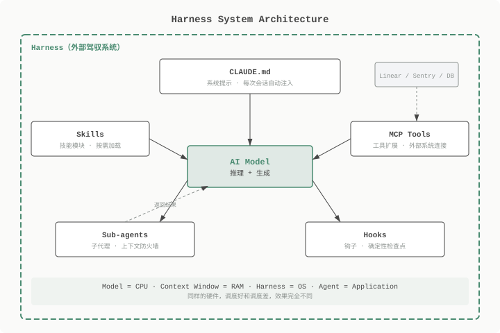
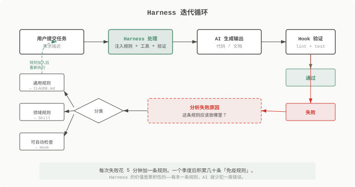

**TL;DR:** AI 模型不可靠——它会犯错、会失忆、会重复犯同一类错误。Harness 是围绕模型的外部系统，通过五个组件（CLAUDE.md、Skills、MCP 工具、子代理、Hooks）系统性地解决这些问题。优化 Harness 比换模型更有效。

> **前置知识**：本文假设读者使用过 Claude Code、Cursor 等 AI 编程助手，了解基本的 prompt 工程概念。如果对 AI 协作方法论不熟悉，建议先阅读 [Spec 驱动开发](/blog/spec-driven-development)。

---

## 一个反直觉的实验

同一个 AI 模型，同一套编码基准测试，第一次得分 42%，第二次 78%。唯一变量不是提示词、不是模型、不是温度设置——是模型外面那套系统。

Mitchell Hashimoto（Terraform 作者）把这个现象总结得很直接：

> "When the AI makes a mistake, don't pray for a better model—design a system that makes it impossible for the AI to make that mistake again."

他不是在说理论。LangChain 团队靠改 Harness（不是换模型）大幅提升了 Agent 表现。OpenAI Codex 团队的经验类似。历史上没有任何一次模型升级能带来接近 2 倍的编码性能提升——但 Harness 优化做到了。

这背后的逻辑不复杂：模型已经接近商品化，Claude、GPT、Gemini 人人都能用。但你的 Harness 是基于你的代码库、你的团队规范、你踩过的坑构建的——这才是差异化的来源。

---

## Harness 是什么

Harness 是围绕 AI 模型的一整套外部配置：规则文件、技能模块、工具连接、子代理、自动检查脚本。它负责在模型「推理」之前注入规则、在模型「生成」之后验证结果。

用计算机系统来类比，关系更清晰：



- **Model** = CPU，负责原始算力
- **Context Window** = RAM，有限的工作内存
- **Harness** = 操作系统，管理上下文、调度工具、验证 I/O
- **Agent** = 应用程序，在 OS 之上跑的业务逻辑

大多数人盯着 CPU（模型）看——哪个模型更强、哪个 benchmark 得分更高。但真正决定体验的往往是 OS。同样的硬件，调度好和调度差，效果完全不同。

下面逐一拆解 Harness 的五个组件。每个组件都是为了解决一个具体问题而存在的。

---

## CLAUDE.md：解决「会话失忆」问题

你用 AI 编程助手时大概率遇到过这种情况：昨天花了半小时跟 AI 解释项目架构和编码规范，今天开新会话，一切归零。你又要重新解释一遍。

这不是 AI 的 bug，是架构限制——每次新会话都是从零开始的。上下文是临时的，不会跨会话保留。

CLAUDE.md 的思路很简单：既然 AI 每次都从零开始，那就把需要它知道的规则写成文件，放在仓库根目录。每次新会话自动注入上下文。

**但问题在于，不是所有规则都应该放进去。**

上下文窗口是有限的。你的 CLAUDE.md 写了 200 行，留给实际工作的空间就被压缩了。而且 AI 读了太多规则反而容易困惑——不知道该优先遵守哪条。

有效的 CLAUDE.md 只包含三类内容：技术栈、测试命令、硬性禁忌。控制在 60 行以内。

```markdown
# 项目规则

## 技术栈
- TypeScript + Next.js 14 (App Router)
- PostgreSQL + Drizzle ORM
- 测试：Vitest + Testing Library

## 硬性禁忌
- 不使用 `any` 类型
- 不在客户端组件中直接导入服务端模块
- 不跳过测试

## 命令
- 测试：`pnpm test`
- 构建：`pnpm build`
- Lint：`pnpm lint`
```

有两个常见的错误。第一，让 AI 生成 CLAUDE.md。AI 倾向于写冗长、充满条件分支的规则（"如果在 src/api/ 目录下，则使用 RESTful 风格"），而人手写的反而更简洁有效。第二，把目录结构写进去。AI 可以自己跑 `ls` 和 `find`，不需要你帮它记目录——这纯粹浪费上下文。

---

## Skills：解决「上下文爆炸」问题

CLAUDE.md 解决了通用规则的注入问题，但它有一个限制：你不能把所有知识都塞进去。

一个中等规模的项目可能涉及十几个知识领域——数据库迁移规范、API 设计约定、前端组件规范、部署流程、错误处理模式。如果全塞进 CLAUDE.md，上下文窗口就撑爆了。

Skills 是按需加载的独立指令文件。跟 CLAUDE.md 的区别在于：CLAUDE.md 每次会话都注入，Skills 只在任务需要时才加载。

```
.claude/skills/
├── db-migration.md       # 数据库迁移规范
├── api-endpoint.md       # API 端点创建规范
├── frontend-component.md # 前端组件规范
└── deploy.md             # 部署流程
```

每个 Skill 文件只管一个领域，通常 20-40 行就够了。当你说「创建一个新的 API 端点」时，Harness 自动加载 `api-endpoint.md`，AI 获得这个领域的专业知识。其他领域的知识不占用上下文。

这和 [Spec 驱动开发](/blog/spec-driven-development) 中的分层加载思路一致——都是通过按需加载来管理有限的上下文窗口。核心问题是同一个：上下文窗口是有限资源，用完了 AI 就变笨。

---

## MCP 工具：解决「闭卷考试」问题

没有工具的 AI 就像闭卷考试——它只能基于训练数据猜测。你问它「这个 bug 怎么修」，它看不到你的代码、看不到错误日志、看不到 Sentry 上的真实报错。它在猜。

而且训练数据有截止日期。你用的是 2026 年 3 月的框架版本，但 AI 的训练数据可能只到 2025 年。API 变了、最佳实践变了，它不知道。

Model Context Protocol（MCP）让 AI 连接外部系统——Linear、Sentry、数据库、GitHub。有了工具，AI 从「闭卷」变成「开卷」：可以查真实数据、拿实时状态、读最新的文档。

但这里有一个反直觉的问题：工具不是越多越好。

每增加一个工具，AI 做决策时要多考虑一个选项。工具太多，AI 会在「该用哪个工具」上浪费推理能力，反而降低了决策质量——这叫「工具混乱」（tool confusion）。

经验法则是：只加当前工作流真正需要的。你做前端开发，连接 Linear 和 GitHub 就够了，不需要再加上数据库直连和 Sentry。

---

## 子代理：解决「上下文变满」问题

随着会话进行，上下文会越来越满——对话历史、文件内容、工具返回值都在消耗上下文窗口。上下文满了之后，AI 的推理能力会明显下降：它开始遗忘前面讨论的内容，生成与之前矛盾的代码。

这个问题在复杂任务中尤其严重。假设你要 AI 分析一个 50 个文件的代码库，然后基于分析结果重构。分析过程会生成大量中间信息——遍历了哪些文件、发现了哪些依赖关系、总结了哪些模式。这些信息占满了上下文，留给重构的空间就不够了。

子代理的思路是：把耗上下文的任务隔离到独立的代理中执行，只返回最终结果给主代理。

```
主代理：「分析 src/ 目录的架构模式」
  → 子代理（独立上下文）：遍历文件、分析依赖、总结模式
  → 返回：300 字的架构摘要
主代理：基于摘要进行重构（上下文几乎没消耗）
```

主代理的上下文只增加了 300 字的摘要，而不是分析过程中产生的几千字中间信息。主代理始终有足够「工作内存」来执行核心任务。

---

## Hooks：解决「不可预测性」问题

前面四个组件解决的都是「让 AI 做得更好」的问题。但有一个根本性的困难：AI 的输出是非确定性的。你给它同样的输入，两次可能产出不同的结果。

这意味着你不能信任 AI 会「记得」跑测试、会「记得」检查 lint。它可能今天记得，明天忘了。你也不能信任它的输出质量——一次生成的代码通过了测试，下一次可能引入一个隐蔽的 bug。

Hooks 就是在关键节点强制执行确定性检查。不管 AI 「想不想」跑测试，Hook 都会跑。

最常用的是 pre-commit hook：提交代码前，自动运行 linter 和测试。失败就阻止提交。

```bash
#!/bin/bash
# .claude/hooks/pre-commit.sh
pnpm lint && pnpm test
if [ $? -ne 0 ]; then
  echo "Lint 或测试失败，阻止提交"
  exit 1
fi
```

类似的还有 post-task hook（任务完成后验证需求规格）和 pre-edit hook（编辑文件前自动备份）。

Hooks 的本质是给非确定性的 AI 加上确定性的护栏。你不需要信任 AI 的自律性——代码会替你检查。

---

## 从失败中迭代

Harness 不是一次性搭好的。它是从实际踩过的坑里迭代出来的。

流程很直接。AI 犯了一个错误——比如生成了使用 `any` 类型的代码。你发现后手动修复。然后问自己：这条规则应该放在哪里？



三种情况：

- **通用规则**（适用于整个项目）→ 加到 CLAUDE.md。比如「不使用 `any` 类型」。
- **领域规则**（只适用于某个场景）→ 创建或更新 Skill。比如「数据库迁移必须包含 rollback 操作」。
- **可自动检查的规则**（能用代码验证）→ 写成 Hook。比如「提交前必须通过 lint」。

每次花 5 分钟就够了。一个季度后，你的 Harness 会积累几十条「免疫规则」——每条都是从真实失败中来的。

这就是 Harness 的复利效应。第一条规则可能只解决一个小问题，但一百条规则叠加起来，AI 的输出质量会有质的变化。而且这些规则是基于你的代码库、你的团队规范、你的领域特例构建的——别人的 Harness 解决不了你的问题。

---

## 局限性与权衡

**前期投入**。写 CLAUDE.md、创建 Skills、配置 Hooks 都要时间。短期内看不到明显提升。Harness 的价值是累积性的——每多一条规则，AI 就少犯一类错误。但你要接受前期投入的回报不在今天。

**过度约束的风险**。规则太多会限制 AI 的创造力。CLAUDE.md 有 200 条规则，AI 会变得过于保守，只敢做你明确允许的事情。Harness 是护栏，不是牢笼。定期审视，删除不再适用的规则。

**模型升级的兼容性**。换模型（比如从 Claude 3.5 到 Claude 4）时，某些规则可能不再适用。不同模型有不同的能力和盲区——3.5 常犯的错，4 可能已经不会犯了。Harness 需要随模型演进调整。

**不适合探索性场景**。如果你还不知道要做什么（原型、技术调研），Harness 的约束反而碍事。Harness 最适合需求明确、需要稳定产出的场景——而这恰恰是大部分工程工作的状态。

---

## 快速开始

不需要额外工具，不需要付费订阅。三步就能开始：

```bash
# 1. 创建 CLAUDE.md（技术栈 + 命令 + 3-5 条禁忌，40 行以内）
touch CLAUDE.md

# 2. 创建第一个 Skill（针对你项目中最常重复的模式）
mkdir -p .claude/skills
touch .claude/skills/api-endpoint.md

# 3. 添加 pre-commit hook
mkdir -p .claude/hooks
# 写入 lint + test 的检查脚本
```

每周五花 15 分钟复盘本周 AI 犯的错误，把它们转化为规则。不需要一次做完所有事情。

---

## 进一步阅读

- [Claude Code CLAUDE.md 最佳实践](https://docs.anthropic.com/en/docs/claude-code/memory) — 系统提示的官方指南
- [Mitchell Hashimoto: AI Coding Agents](https://mitchellh.com/writing/ai-coding-agents) — Harness 思想的原始阐述
- [Spec 驱动开发](/blog/spec-driven-development) — 相关的 AI 协作方法论，侧重需求到代码的结构化流程
- [LangChain Agent Architecture](https://python.langchain.com/docs/concepts/agents/) — Agent 系统的工具调用与状态管理
- [Model Context Protocol Specification](https://modelcontextprotocol.io/) — MCP 工具扩展协议的完整规范
