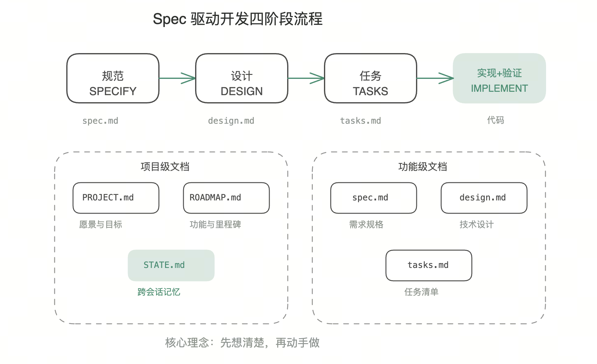

**TL;DR:** Spec 驱动开发是一种与 AI 编程助手协作的方法论。核心思想是「先想清楚，再动手做」——通过规范、设计、任务、实现四个阶段，将模糊的需求逐步细化为可执行的代码。所有中间产物以 Markdown 文件形式保存在项目中，实现跨会话记忆和跨工具协作。

> **前置知识**：本文假设读者使用过 Cursor、Claude Code、Kimi Code 等 AI 编程助手，了解 prompt 工程的基本概念。

---

## 问题：AI 编程助手的「失忆症」

使用 AI 编程助手时，你可能遇到过这些问题：

每次新会话都要重新解释项目背景。昨天讨论过的架构决策，今天 AI 完全不记得。你说「继续昨天的工作」，AI 一脸茫然。

复杂功能开发到一半，上下文窗口爆了。AI 开始「幻觉」，生成与之前讨论矛盾的代码。你不得不开新会话，然后又要重新解释一遍。

多人协作时更糟糕。你和同事用同一个 AI 助手开发同一个功能，但 AI 对你们说的话完全不一致。没有共享的「记忆」，协作变成了各自为战。

这些问题的根源在于：AI 的上下文是临时的，而软件开发是持续的。

---

## 解决方案：把「记忆」写进项目

Spec 驱动开发的核心思想很简单：既然 AI 没有持久记忆，那就把记忆写成文件，保存在项目里。

每次会话开始时，AI 读取这些文件，恢复上下文。每次会话结束时，AI 更新这些文件，保存进度。文件跟着项目走，换一个 AI 工具也能继续工作。

这不是什么新发明。软件工程早就有类似的实践：需求文档、设计文档、任务看板。Spec 驱动开发只是把这些实践标准化，让 AI 能够理解和操作。

---

## 四阶段工作流

整个方法论分为四个阶段，每个阶段都有明确的输入、输出和验证标准。

[](https://excalidraw.com/#json=X3irIN2Ww0fisP5aq01r0,qM2hNFA9D2wNFxAVZlKwng)

### 阶段一：规范（Specify）

这个阶段回答「做什么」的问题。输入是模糊的需求描述，输出是结构化的需求规格文档。

触发词是「规范功能」。比如你说「规范功能：用户登录」，AI 会生成一个 `spec.md` 文件，包含用户故事、功能需求、验收标准和边界情况。

```markdown
# 功能：用户登录

## 用户故事
作为用户，我希望通过邮箱和密码登录，以便访问我的个人数据。

## 功能需求
1. 支持邮箱+密码登录
2. 登录成功后返回 JWT Token
3. 密码错误时返回模糊提示（不透露是邮箱不存在还是密码错误）
4. 支持「记住我」功能（Token 有效期 7 天）

## 验收标准
- [ ] 正确的凭据返回 200 + Token
- [ ] 错误的密码返回 401
- [ ] 不存在的用户返回 401（与密码错误一致）
- [ ] Token 包含用户 ID 和过期时间

## 边界情况
1. 邮箱格式不合法 → 返回 400
2. 密码为空 → 返回 400
3. 账户被禁用 → 返回 403 + 提示信息
```

这个阶段的价值在于：强迫你把需求想清楚。很多 bug 不是代码写错了，而是需求没想清楚。

### 阶段二：设计（Design）

这个阶段回答「怎么做」的问题。输入是需求规格，输出是技术设计文档。

触发词是「设计功能」。AI 会基于 `spec.md` 生成 `design.md`，包含 API 设计、数据模型、安全方案和错误处理策略。

```markdown
# 设计：用户登录

## API 设计
POST /api/v1/auth/login
Content-Type: application/json

{
  "email": "user@example.com",
  "password": "secret",
  "remember": true
}

## 数据模型
- 复用现有的 `users` 表
- 新增 `refresh_tokens` 表存储长期 Token

## 安全考虑
1. 密码使用 bcrypt 验证（cost factor = 12）
2. 速率限制：5 次/分钟/IP
3. JWT 使用 RS256 签名，私钥存储在环境变量

## 错误处理
| 场景 | HTTP 状态码 | 响应体 |
|------|------------|--------|
| 凭据错误 | 401 | `{"error": "invalid_credentials"}` |
| 账户禁用 | 403 | `{"error": "account_disabled"}` |
| 请求过频 | 429 | `{"error": "rate_limited"}` |
```

如果你在现有项目中开发，AI 会先读取代码库分析文档（后面会讲），确保设计与现有架构一致。

### 阶段三：任务分解（Tasks）

这个阶段把设计拆成可执行的原子任务。输入是技术设计，输出是任务清单。

触发词是「分解为任务」。AI 会生成 `tasks.md`，每个任务都有明确的完成标准和验证方法。

```markdown
# 任务：用户登录

## 任务 1：创建数据库表
- [ ] 创建 `refresh_tokens` 表
- **验证**：运行 migration，检查表结构

## 任务 2：实现登录 API
- [ ] 创建 POST /api/v1/auth/login 端点
- [ ] 实现密码验证逻辑
- [ ] 实现 JWT 生成
- **验证**：
  - 单元测试覆盖正常流程和边界情况
  - 手动测试 API 响应

## 任务 3：添加安全机制
- [ ] 实现基于 IP 的速率限制
- [ ] 配置 bcrypt cost factor
- **验证**：连续发送 6 次请求，第 6 次返回 429
```

任务的粒度很重要。太大了 AI 容易跑偏，太小了又浪费时间。经验法则是：一个任务应该能在 10-30 分钟内完成，产出可验证的结果。

### 阶段四：实现与验证（Implement + Validate）

这个阶段才开始写代码。触发词是「实现任务 N」。

AI 会读取对应的任务描述，生成代码，然后按照验证标准检查结果。完成后自动更新任务状态。

```
"实现任务 1：创建数据库表"
→ AI 生成 migration 文件
→ 运行 migration
→ 验证表结构
→ 标记任务 1 为 done

"实现任务 2：实现登录 API"
→ AI 生成 controller、service、测试
→ 运行测试
→ 验证覆盖率
→ 标记任务 2 为 done
```

每个任务完成后，`tasks.md` 中的状态会更新。下次会话时，AI 读取这个文件就知道做到哪里了。

---

## 项目结构

所有文档都保存在项目根目录的 `.specs/` 文件夹中：

```
.specs/
├── project/
│   ├── PROJECT.md      # 项目愿景与目标
│   ├── ROADMAP.md      # 功能路线图
│   └── STATE.md        # 会话状态（当前进度、阻塞、决策记录）
├── codebase/           # 现有代码库分析（可选）
│   ├── STACK.md        # 技术栈
│   ├── ARCHITECTURE.md # 架构
│   ├── CONVENTIONS.md  # 编码规范
│   ├── STRUCTURE.md    # 目录结构
│   ├── TESTING.md      # 测试策略
│   └── INTEGRATIONS.md # 外部集成
└── features/           # 功能规格
    └── user-login/
        ├── spec.md     # 需求规格
        ├── design.md   # 技术设计
        └── tasks.md    # 任务清单
```

这个结构有几个设计考量：

`project/` 目录存放项目级信息，每次会话都会加载。`STATE.md` 是跨会话记忆的核心，记录当前进度、阻塞项和历史决策。

`codebase/` 目录是可选的，用于在现有项目中开发。通过「映射代码库」命令生成，帮助 AI 理解现有架构。

`features/` 目录按功能组织，每个功能一个子目录。这样可以按需加载，避免上下文爆炸。

---

## 上下文管理策略

大语言模型的上下文窗口是有限的。即使是 200k token 的模型，也不能把所有文档一股脑塞进去。Spec 驱动开发采用分层加载策略：

**基础层（每次会话必加载，约 15k tokens）**：
- `PROJECT.md` — 项目愿景，让 AI 知道在做什么
- `ROADMAP.md` — 功能列表，让 AI 知道整体规划
- `STATE.md` — 当前状态，让 AI 知道做到哪里了

**按需层（根据当前任务加载）**：
- 处理现有项目时加载 `codebase/` 目录
- 处理特定功能时加载对应的 `spec.md`
- 按设计实现时加载 `design.md`
- 执行任务时加载 `tasks.md`

**绝不同时加载**：
- 多个功能的规格文档
- 多个架构分析文档

目标是把总上下文控制在 40k tokens 以内，给实际工作预留 160k+ 的空间。

---

## 跨会话记忆

`STATE.md` 是实现跨会话记忆的关键。它的结构大致如下：

```markdown
# 项目状态

## 当前会话
- **最后工作**：用户登录功能的任务 3
- **状态**：进行中
- **阻塞**：等待安全团队确认速率限制策略

## 决策记录
- 2026-02-28: 选择 PostgreSQL 而非 MySQL
  - 原因：JSON 字段支持更好，适合存储用户偏好
- 2026-02-27: 选择 JWT 而非 Session
  - 原因：支持多端登录，便于水平扩展

## 用户偏好
- 使用中文回复
- 代码注释用英文
- 测试框架：Jest
```

每次会话结束时，AI 会更新这个文件。下次会话开始时，AI 读取这个文件就能恢复上下文。

你也可以手动编辑这个文件。比如记录一个重要决策，或者标记某个任务被阻塞了。

---

## 跨工具协作

这套方法论的一个意外收获是：它让你可以在不同的 AI 工具之间无缝切换。

因为所有状态都保存在项目文件中，而不是某个工具的云端。你可以用 Cursor 开始一个功能，用 Claude Code 继续，再用 Kimi Code 收尾。每个工具读取同样的 `.specs/` 目录，看到同样的进度。

这在实践中很有用。不同的 AI 工具有不同的优势：有的擅长代码生成，有的擅长调试，有的擅长文档。你可以根据任务选择最合适的工具，而不用担心上下文丢失。

---

## 实践建议

### 应该做的

**每次会话先读 STATE.md**。这是恢复上下文的第一步。如果你使用的 AI 工具支持自动加载，配置好让它自动读取。

**一个功能走完完整流程**。不要跳过设计直接编码。每个阶段都有价值：规范阶段帮你想清楚需求，设计阶段帮你想清楚方案，任务阶段帮你想清楚步骤。

**及时更新任务状态**。完成一个任务就标记一个。这不仅是给 AI 看的，也是给自己看的。

**记录关键决策**。为什么选择方案 A 而非 B？这个技术债务是有意为之还是无奈之举？这些信息对未来的你（和未来的 AI）都很有价值。

### 应该避免的

**一次处理多个功能**。这会导致上下文爆炸，降低输出质量。专注于一个功能，完成后再开始下一个。

**跳过验证步骤**。每个任务都要有验证标准。没验证等于没完成。AI 生成的代码不一定正确，验证是质量保证的最后一道防线。

**在实现阶段改设计**。如果发现设计有问题，回到设计阶段修改 `design.md`，然后重新分解任务。保持各阶段职责清晰。

---

## 与传统开发的对比

| 维度 | 传统方式 | Spec 驱动 |
|------|----------|-----------|
| 需求管理 | 口头沟通或零散文档 | 结构化的 spec.md |
| 设计评审 | 会议讨论，记录分散 | design.md 可追溯 |
| 任务跟踪 | Jira/Trello 等外部工具 | tasks.md 与代码同仓库 |
| AI 协作 | 每次重新解释上下文 | 自动加载项目状态 |
| 跨工具 | 状态锁定在特定工具 | 文件级别的可移植性 |

Spec 驱动开发不是要取代传统的项目管理工具，而是在 AI 协作场景下提供一个轻量级的补充。对于个人项目或小团队，它可能就够用了。对于大团队，它可以作为 AI 协作的「接口层」，与现有工具并存。

---

## 局限性与权衡

这套方法论不是银弹，有几个明显的局限：

**前期投入**。写规范和设计需要时间。对于简单的功能，这个投入可能不值得。经验法则是：如果一个功能能在 30 分钟内完成，直接写代码可能更快。

**文档维护**。代码改了，文档也要改。如果不及时更新，文档会变成误导。这需要纪律。

**学习曲线**。团队成员需要学习这套流程和触发词。初期可能会觉得繁琐。

**不适合探索性开发**。如果你还不知道要做什么，先写规范是没意义的。这套方法论更适合需求相对明确的场景。

---

## 快速开始

如果你想尝试这套方法论，可以从以下步骤开始：

**新项目**：
```
"初始化项目"
→ 创建 PROJECT.md（愿景、目标、成功标准）

"创建路线图"
→ 创建 ROADMAP.md（功能列表、优先级）

"规范功能：[功能名称]"
→ 进入功能级开发流程
```

**现有项目**：
```
"映射代码库"
→ 生成 codebase/ 目录下的 6 个分析文档

"初始化项目"
→ 创建 PROJECT.md + ROADMAP.md

"规范功能：[功能名称]"
→ 进入功能级开发流程
```

**暂停与恢复**：
```
"暂停工作"
→ 自动更新 STATE.md，记录当前进度

"继续工作"
→ 读取 STATE.md，从上次位置继续
```

---

## 进一步阅读

- [tlc-spec-driven-zh 技能文档](https://github.com/example/tlc-spec-driven-zh) — 完整的技能定义和模板
- [Cursor Rules 最佳实践](https://cursor.sh/docs/rules) — 如何配置 AI 编程助手
- [The Twelve-Factor App](https://12factor.net/) — 现代应用开发的方法论，与 Spec 驱动开发理念相通

---

一句话总结：**Spec 驱动开发 = 想清楚 + 写下来 + 按步骤执行 + 验证完成**。

它不会让 AI 变得更聪明，但会让你和 AI 的协作更高效。
